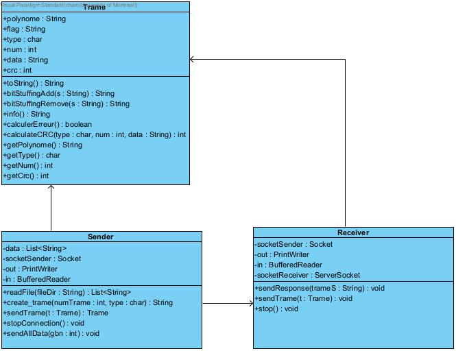

# Rapport TP2 IFT3325

Nadia CHARONOV 20121063
Léo ANNETTE 20137984 

Diagramme de classe :

####Receiver.java

Classe qui creer un serveur sur un port donné, recoit les trames, les analyses et envoie une reponse au client Sender (Acquitement)

    private ServerSocket socketReceiver;
    private Socket socketSender;
    private PrintWriter out;
    private BufferedReader in;

Paramettre necessaire pour les sockets

    public Receiver(int port) throws IOException {}

Methode qui ouvre une connection sur un port, et attant qu'un client se connecte dessus, et lit les trames recus.

    public static void main(String[] args) throws NumberFormatException, UnknownHostException, IOException {}

Cree une instance de receiver, puis ferme la connection quand toutes les trames ont été envoyées

    public void sendResponse(String trameS) throws IOException {}

Cette méthode est executée quand on recoit la trameS et decide de la trame envoyé en réponse. (de type R pour une erreur ou A pour acquiter)

        public void sendTrame(Trame t) throws IOException {}

Cette méthode permet d'envoyer la trame t au Sender

        public void stop() throws IOException {}

Ferme la connection

####Sender.java    

Classe qui se connecte sur une ip et un port donné, envoie les données du fichiers sous forme de trames, analyses les trame reçues et re-transfere les données du fichier si nécessaire

    
    public List<String> data;
    private Socket socketSender;
    private PrintWriter out;
    private BufferedReader in;

Parametre data contenant une liste des données du fichiers et des paramettre pour la connections au socket

	public Sender(String ip, int port, String fileDir, int gbn) throws UnknownHostException, IOException, InterruptedException {}

Cree une instance de sender qui se connecte a l'ip et au port donnés

        public static void main(String[] args) throws NumberFormatException, UnknownHostException, IOException, InterruptedException {}

Cree une instance de sender qui se connecte a l'ip et au port donnés et ferme la connection quand toutes les trames sont envoyées

        public Trame sendTrame(Trame t) throws IOException {}

Methode qui permet d'envoyer la trame t au receiver et de lire la trame réponse qui est retourné

        public void stopConnection() throws IOException {}

Ferme la connection avec le socket 

    	public List<String> readFile(String fileDir){}

Lit le fichier qui contient les données

	public void sendAllData(int gbn) throws IOException, InterruptedException {}

Cette méthode envoie toute les données contenue dans this.data et s'occupe de la gestion d'erreur

####Trame.java

Class qui cree des instances de trames avec  les parametre suivants

	public String polynome = "10001000000100001";
	public String flag = "01111110";
	public char type;
	public int num;
	public String data;
	public int crc;

Trame possede 2 constructeurs
1.

    public Trame(char type, int num, String data) {}

Qui cree une trame à partir des paramètres que l'on possede :
    - Type
    - Num
    - Data

2.
   
    public Trame(String trame) {

Qui permet de decoder une String pour la transfomré en Trame

    @Override
    public String toString()

Nous avons également override toString() afin de creer une string a partir des parametres donnés (assemblage et bit stuffing)

    public String bitStuffingAdd(String s) {}
    public String bitStuffingRemove(String s) {}

Ces méthodes permettent d'ajouter ou d'enlever le bit stuffing de la trame s qui est passé en paramettre sous forme de String

    public String info() {}

Une méthode qui retourne un String que l'on peut imprimé pour avoir un beau formatage des informations de la trame

    public boolean calculerErreur(){}

Calcul le reste  de  la division de  T(x)  par  G(x) pour detecter les erreurs dans la trame.
Le retour est initialisé a True et si une erreur est détectée, retourn True.

    public int calculateCRC(char type, int num, String data){}

Calcule le CRC sur les champs type,num et data .

    // methodes get
	public String getPolynome() {
		return this.polynome;
	}
	
	public char getType() {
		return this.type;
	}
	
	public int getNum() {
		return this.num;
	}
	
	public String getData() {
		return this.data;
	}
	
	public int getCrc() {
		return this.crc;
	}
	
Quelques méthode get pour retourner les variables 