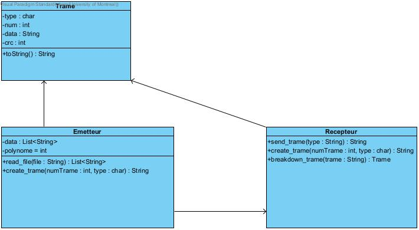

# Rapport TP2 IFT3325

Nadia CHARONOV 20121063
Léo ANNETTE 20137984 

Diagramme de classe :

TODO :
brève description sur chaque classe et chaque méthode utilisée (c.-à-d. nom de la
méthode, ses paramètres, sa fonction, son output).

######Receiver.java
Ouvre une connection sur un port, et ne peux pas terminer la connexion tant qu'on recoit des requetes

Quand  une trame est reçu, la fonction sendResponse detecte les erreurs et decide de la trame réponse a envoyer 

######Sender.java

 sendAllData() envoie des data au Receiver auquel on s'est connecté en utilisant sendTrame() qui envoie une trame au Receiver et retourne la trame réponse
    

######Trame.java

Permet de lire une trame sous forme de String 

